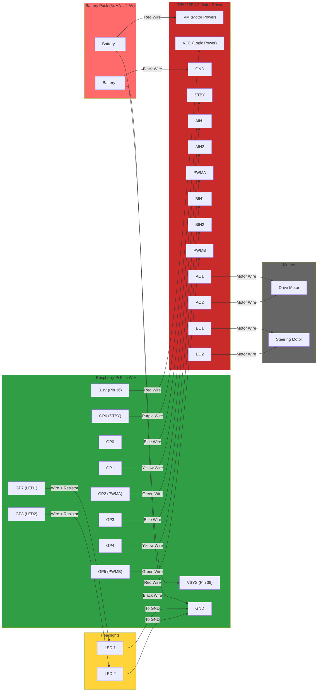

# Pico RC Car - WiFi Controlled

WiFi-controlled RC car using Raspberry Pi Pico W with web-based interface.

## Requirements

**Firmware**: MicroPython for Raspberry Pi Pico W
- Download from [micropython.org](https://micropython.org/download/RPI_PICO_W/)
- Flash using Thonny IDE or drag-and-drop bootloader method

## Hardware

**Motor Driver**: TB6612FNG dual motor driver
- Motor A: Drive motor (forward/backward)
- Motor B: Steering motor (left/right)
- Standby: GPIO 6 (active high)

**Pin Configuration**:
```
Motor A (Drive):    AIN1=GPIO0, AIN2=GPIO1, PWMA=GPIO2
Motor B (Steering): BIN1=GPIO3, BIN2=GPIO4, PWMB=GPIO5
Headlights:         LED1=GPIO7, LED2=GPIO8
```

**Power**: 3x AA batteries (4.5V)
- VM (motor power) and VSYS from battery positive
- VCC (logic) from Pico 3.3V output

**PWM**: 1000 Hz, 16-bit duty cycle (65535 full speed)

## Network

**WiFi AP**:
- SSID: `RC-Car`
- Password: `12345678`
- IP: `192.168.4.1`

## Control

Web interface at `http://192.168.4.1`

**Commands**:
- `forward` / `reverse` - Drive motor, LEDs on
- `left` / `right` - Steering motor
- `center` - Center steering
- `stop` - Stop all, LEDs off

Touch/mouse press activates, release auto-stops/centers.

## Usage

1. Power on Pico W
2. Connect to "RC-Car" WiFi
3. Browse to `http://192.168.4.1`
4. Control via web buttons

## Wiring Diagram


